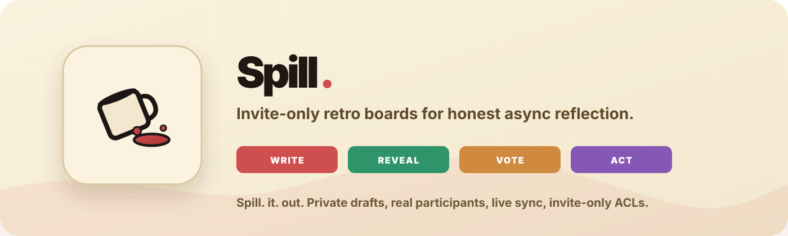
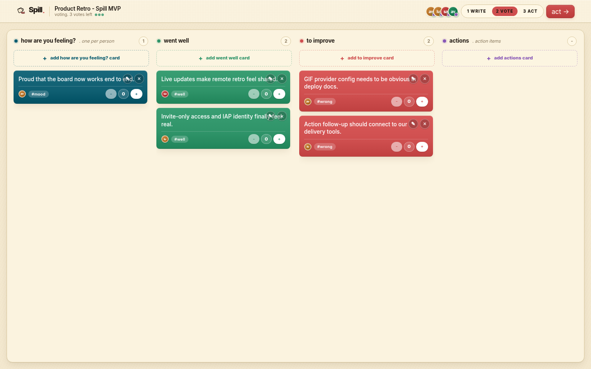
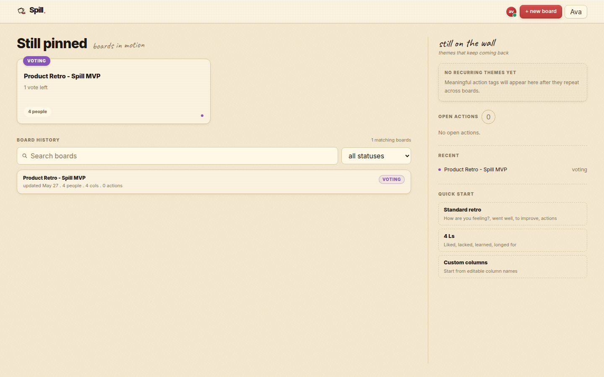

# Spill.



**Invite-only retro boards for teams that want the truth without the ceremony.**

Spill. is a board-first retrospective app that lets teams write privately,
reveal together, vote, turn the highest-signal pain points into actions, and
keep a searchable history of what keeps coming back.



## Why Spill.

- **Private first:** drafts stay private until reveal.
- **Real collaboration:** participants, authors, ready state, votes, and live
  board updates are backed by the API.
- **Invite-only access:** email-backed ACLs decide who can see and mutate a
  board.
- **Actions, not theatre:** top-voted friction turns into action candidates the
  team can confirm, reject, edit, and complete.
- **Expressive by default:** GIF search and card media are part of the retro,
  not decorative afterthoughts.



The repo/package name is `spillio`.

## MVP status

Spill. is in a stable MVP shape:

- end-to-end retro flow works
- boards persist in Postgres
- cards, votes, ready state, participants, actions, summaries, deliveries, and
  history are backed by the Rust API
- board updates sync through WebSockets, with reconnect and polling fallback
- production identity is header/proxy based, suitable for Google IAP or a
  trusted auth proxy
- email identity controls board ownership, visibility, invitations, and ACLs
- boards are invite-only
- local mode is available for development without a real auth provider

AI and external delivery integrations are intentionally still placeholder seams
where the product needs provider-specific wiring.

## How the retro works

Spill. is not an "AI runs your retro" tool. The core product is the board.
AI can help organize, summarize, or propose follow-up, but humans own the
retro content and decisions.

1. **Writing**
   - Participants add private cards.
   - Other participants cannot read your drafts until reveal.
   - Participants mark ready when done.

2. **Discussion**
   - The board reveals cards for team discussion.
   - Cards can be edited, moved, grouped, and annotated.

3. **Voting**
   - Participants vote on what deserves action.
   - Vote limits are board settings.

4. **Action discussion**
   - Top-voted items are converted into action candidates.
   - The team confirms, rejects, edits, and completes actions.

5. **Wrapped recap**
   - Completed boards stay available from history.
   - Recurring tags and open actions are surfaced across boards.

## What ships in the MVP

- standard and custom templates
- private draft visibility before reveal
- real participants and card authors
- GIF search and GIF-backed cards
- manual card grouping
- ready state in async phases
- voting and vote counts
- action lifecycle
- meeting notes and AI artifact records
- delivery records for exports/integrations
- board history with active/completed boards

## Access and identity

Production identity is expected to come from a trusted upstream auth layer such
as Google IAP, oauth2-proxy, or an equivalent reverse proxy.

The web app reads upstream identity headers and sends normalized identity to the
Rust API. Email is the ownership key:

- display name is user-facing only
- email defines board ownership and visibility
- board creators become host grants
- invitees become member grants
- uninvited users see access denied
- every board mutation is authorized against the participant/grant model

Useful web env vars:

```bash
SPILLIO_AUTH_MODE=proxy
SPILLIO_AUTH_EMAIL_HEADER=x-goog-authenticated-user-email
SPILLIO_AUTH_NAME_HEADER=x-goog-authenticated-user-name
SPILLIO_API_URL=http://api:4000
NEXT_PUBLIC_SPILLIO_API_URL=https://your-public-api.example.com
```

For local development, `SPILLIO_AUTH_MODE=local` enables a self-claimed email
and display name form. Local mode is not secure and should not be used as a
production auth boundary.

## Architecture

- **Web:** Next.js app in `apps/web`
- **API:** Rust Axum API/WebSocket service in `services/api`
- **Domain:** Rust crates under `services/api/crates`
- **Database:** Postgres with SQLx migrations
- **Companions:** connector/ingestion helpers in `packages/companions`

The Rust API owns durable board state, visibility rules, phase transitions,
participants, grants, votes, and WebSocket events. The Next.js app renders the
product and calls the API through typed JSON contracts.

## Local development

Prerequisites:

- Node.js 22
- pnpm
- Rust toolchain
- Docker, for local Postgres

```bash
pnpm install
cp .env.example .env
pnpm db:up
pnpm db:migrate
```

Run the API:

```bash
set -a; source .env; set +a
cargo run -p spillio-api -- serve
```

Run the web app:

```bash
pnpm dev:web
```

Default local URLs:

- web: `http://127.0.0.1:3000`
- API: `http://127.0.0.1:4000`
- API health: `http://127.0.0.1:4000/health`

GIF search requires `SPILLIO_KLIPY_API_KEY`. Without it, the API returns a
degraded empty GIF response instead of failing the board.

## Production-ish local run

```bash
docker compose --profile app up --build
```

The compose profile runs Postgres, migrations, the Rust API, and the web app.
For a real deployment, run migrations before serving traffic.

## Checks

```bash
pnpm check
pnpm build
```

`pnpm check` runs:

- web TypeScript checks
- companion package tests
- Rust workspace tests against Postgres

## Important configuration

API:

- `DATABASE_URL`
- `SPILLIO_API_ADDR`
- `SPILLIO_KLIPY_API_KEY`
- `RUST_LOG`

Web:

- `SPILLIO_API_URL`
- `NEXT_PUBLIC_SPILLIO_API_URL`
- `SPILLIO_AUTH_MODE`
- `SPILLIO_AUTH_EMAIL_HEADER`
- `SPILLIO_AUTH_NAME_HEADER`

## Project docs

- `docs/product-overview.md`
- `docs/api-contracts.md`
- `docs/deployment.md`
- `docs/designer-mock-brief.md`
- `docs/mvp-product-doc.md`
- `docs/tech-stack-design.md`
- `docs/implementation-plan.md`
- `docs/companions.md`
- `mock/index.html`
